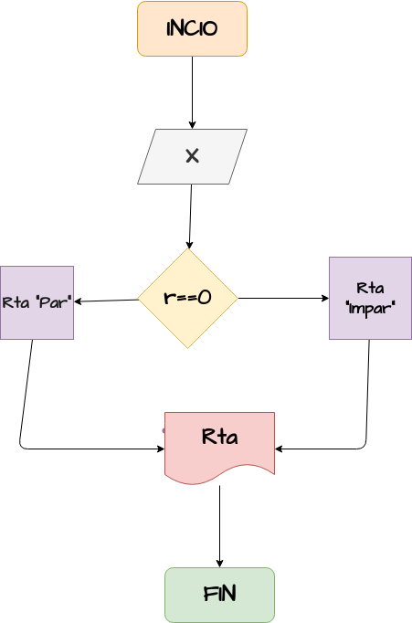

# Ejercisio No.4 
 ## Par_Impar
Programa para verificar si un número es par o impar

# ANALISIS

Variabes de entrada (input)

r= x%2

Variables de proceso y salida (precessing, storage, output)
r== 0

# DISEÑO

# CONSTRUCCION